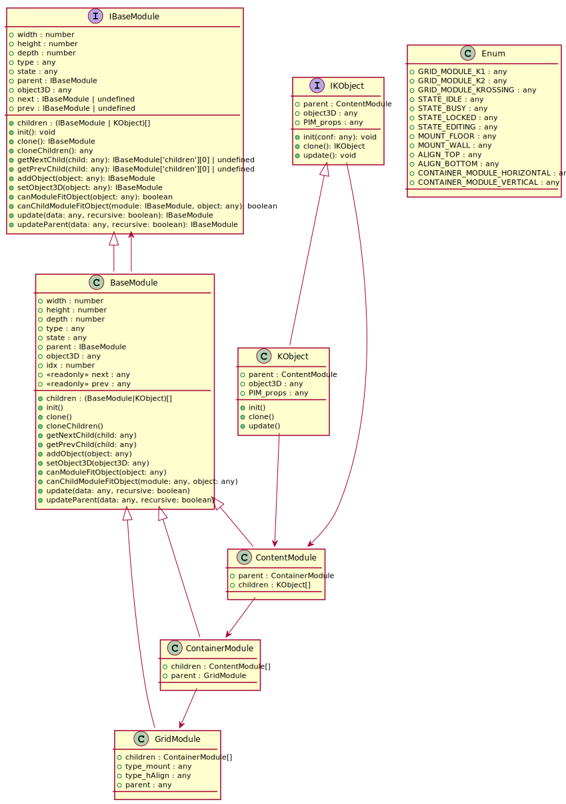
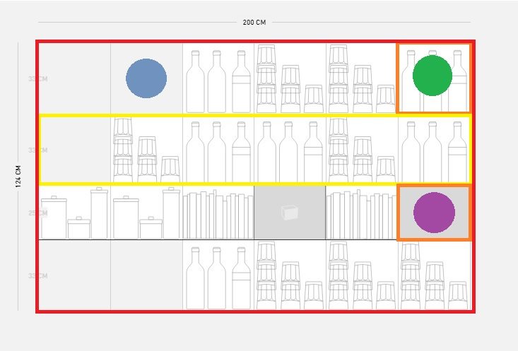
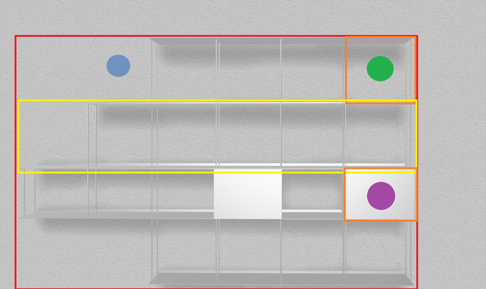

Proposal for the Kriptonite grid

This is a UML class diagram proposal for the Kriptonite grid.

Entities are 
- GridModule (K1, K2, Krossing)
- ContainerModule (Vertical Module for K1, K2, Horizontal Module for Krossing)
- ContentModule (portion of a ContainerModule that can fit an object)
- KObject (Kriptonite Object. This would be analog to a component. Contains _PIM props_ and the threejs object3D created according to the PIM props) 

The GridModule is meant to be parsed during rendering to generate the webgl view (and the additional visual clues/ui controls)

- &nbsp;GridModule
- &nbsp;ContainerModule
- &nbsp;ContentModule
- &nbsp;ContentModule.children=null
- &nbsp;ContentModule.children = [KObject Shelf]
- &nbsp;ContentModule.children = [KObject Shelf, KObject Box]

Module classes inherit from BaseModule. 
Here main property and methods are listed, more to be added.
Specific business logic and visualization logic of modules will be dependent on type and parent.type

Example  
ContainerModule.canChildModuleFitObject(ContentModule, KObject)

Logic will depend on 
- ContainerModule.type (Enum.CONTAINER_MODULE_HORIZONTAL or Enum.CONTAINER_MODULE_VERTICAL)
- parent.type (Enum.GRID_MODULE_K1 or Enum.GRID_MODULE_K2 or Enum.GRID_MODULE_KROSSING)
- parent.type_mount (Enum.MOUNT_WALL or Enum.MOUNT_FLOOR)
- parent.type_hAlign (Enum.ALIGN_TOP or Enum.ALIGN_BOTTOM)

